# Herramientas de gestión de Proyectos:

### Análisis de la herramienta **Redmine**:
- ¿Qué son las herramientas CI/DC?
    Son métodos para distribuir las aplicaciones a los clientes con frecuencia mediante el uso de automatización en las estapas de desarrollo.

- ¿Qué es, y dentro de que grupo de las herramientas CI/DC esta?
    Redmin es una herramienta de gestión de proyectos creada el 15 de junio de 2006 por Jean-Philippe Lang

- ¿Qué ofrece?
    Redmine ofrece diferentes funcionalidades tales como; seguimiento de indices, errores, calendario de actividades, diagramas, control basado en roles, integración con correo electrónico .
    
- Plan de precios.
    Redmine es de código libre y no hay versión de pago.

- Ejemplo de integración co repositorios de código.
- Ejemplo de documentación de proyectos.
- Otras herramientas con las que se integra.
- Comparativa con otras herramientas.
- ¿Por qué escoger la herramienta frente a otras?

---

 

*Redmine* es una herramienta de gestión de proyectos y seguimiento de problemas que permite realizar un **seguimiento del progreso de proyectos**, **bugs** y **tareas dentro de una organización**. Es de código abierto y se puede personalizar para adaptarse a las necesidades específicas de cada organización. Ofrece una amplia gama de **características** que incluyen seguimiento de tiempo, **seguimiento de errores, gestión de documentos, gestión de proyectos, gestión de versiones, colaboración en equipo, y más**. Además, *Redmine* tiene una **interfaz visual** y fácil de usar que simplifica la gestión de proyectos y ayuda a los equipos a colaborar y comunicarse. 

Se trata de una herramienta gratuita para descargar e instalar, lo que la hace una opción de bajo costo para las organizaciones que buscan una solución de seguimiento de problemas y gestión de proyectos integrados. También hay un gran número de complementos disponibles que la ayudan a ampliar sus capacidades.

La integración de *Redmine* con repositorios de código, como *Git*, es sencilla gracias a su soporte para **integración continua** (CI) y **entrega continua** (CD). Además, es altamente personalizable y los desarrolladores pueden expandir su funcionalidad mediante el uso de script. 

La documentación de proyectos en *Redmine* es detallada y personalizable. Es compatible con varios formatos de archivo, como Microsoft Word, Excel y PDF, lo que facilita la gestión de documentos. 

También se *integra* con otras herramientas populares para la gestión de proyectos y el seguimiento de problemas, como **JIRA**, **GitHub**, y **GitLab**. 

En comparación con otras herramientas de gestión de proyectos y seguimiento de errores, como JIRA y Trello, *Redmine* es más personalizable y económico además de poder funcionar tanto para **organizaciones pequeñas** como **grandes** debido a su flexibilidad y escalabilidad.

En resumen, *Redmine* es una herramienta de gestión de proyectos y seguimiento de errores de **código abierto** que ofrece una amplia variedad de características y funcionalidades personalizables a bajo costo. Con **integraciones con repositorios** de código, una **documentación completa**, y **complementos disponibles**, es una herramienta a tener en cuenta para la gestión de proyectos y seguimiento de errores.

## Fuentes de instalación

Para la realización de este proyecto hemos usado la siguiente [fuente](https://github.com/sameersbn/docker-redmine).

Debido a diversos problemas instalando la aplicación descargada en la [web oficial](https://www.redmine.org/) de Redmine decidimos montar un contenedor [Docker](https://www.docker.com/) que nos facilitara y agilizara el trabajo.

### Instalación Docker
Primeramente hemos descargado el fichero **docker-compose.yml**, fichero de configuración para la herramienta de ejecución y definición de aplicaciones en contenedores denominada Docker Compose.

> Fichero **docker-compose.yml**

> Mediante el comando `docker-compose up` podemos crear el contenedor que contiene nuestro proyecto, así de sencillo.

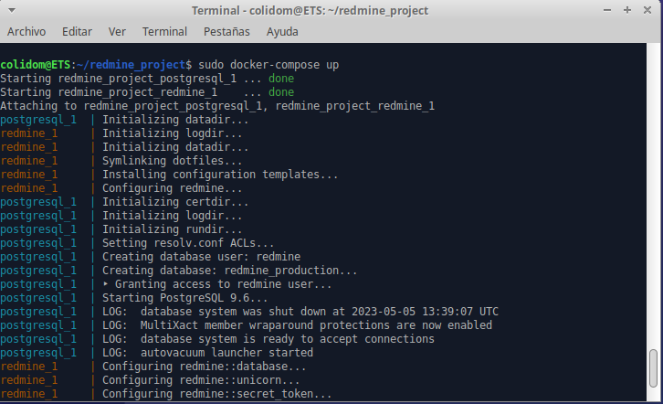

### Configuración de usuario admin (first login)
Tras finalizar la instalación el sistema nos pedirá que cambiemos la contraseña predefinida en el sistema:

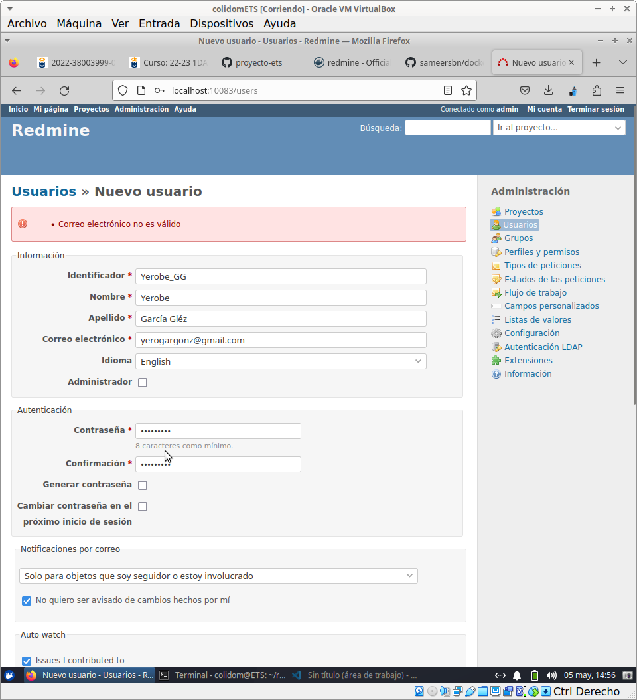
  
Dentro de Redmine tenemos facilitada la opción de **crear usuarios** junto a diversas opciones.

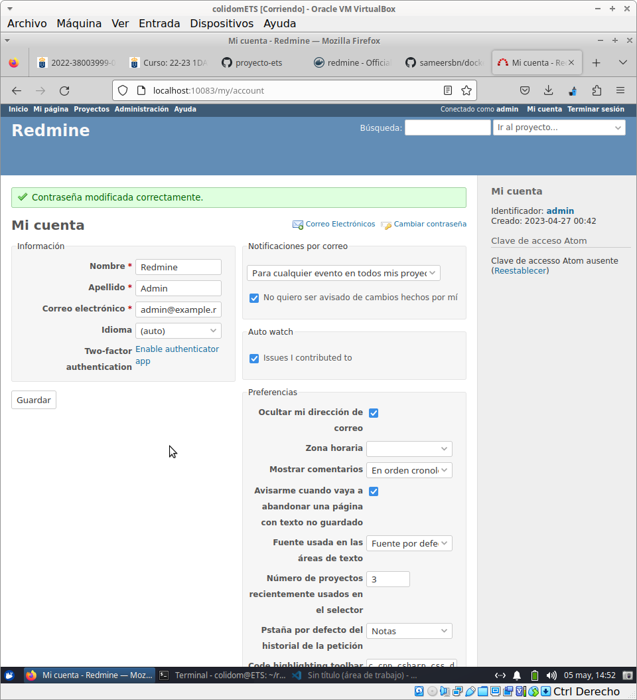
  
Esta misma cuenta también podra ser **modificada** mas adelante en el caso de que lo requiramos.

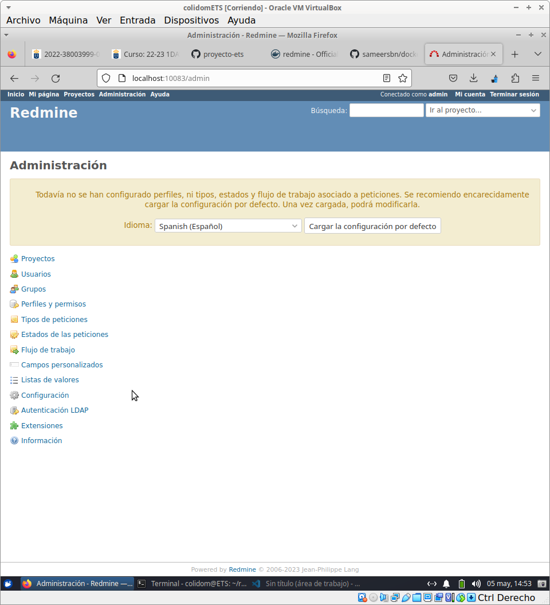
  
También cuenta con una pestaña de **Administración** en la que podremos gestionar los proyectos, usuarios, grupos a los que pertenecemos, permisos consultar estados etc...

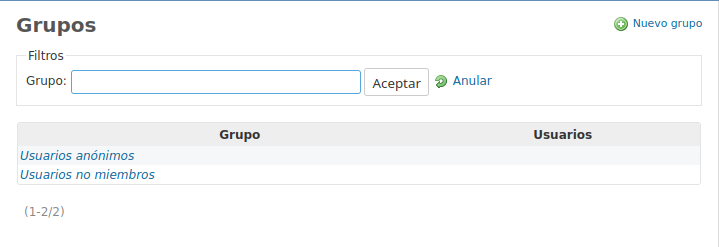
  
Podemos **filtrar** por varios grupos, crear uno nuevo si nos resulta necesario y consultar que usuarios son anónimos y cualers no son miembros.

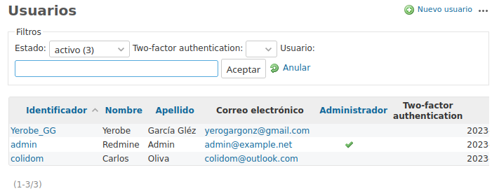
  
Al igual que **otras herramientas** de gestión como puede ser GitHub en esta podemos ver los usuarios que estan asignados dentro de nuestro mismo proyecto, al igual que la opción de ver el correo electronico y si tiene permisos de Administrador.

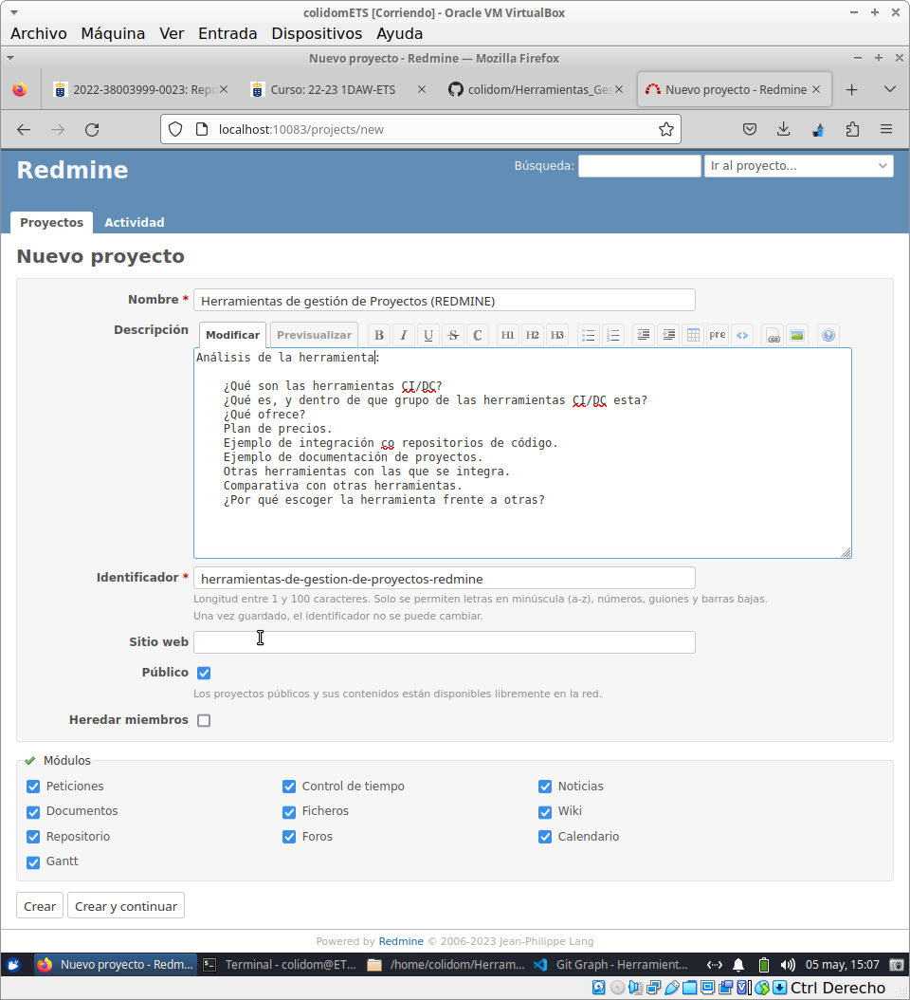
  
También podemos **modificar** el nombre y la descripción de los proyectos, asignar si queremos que sean públicos o no y los módulos a los que estan asignados.

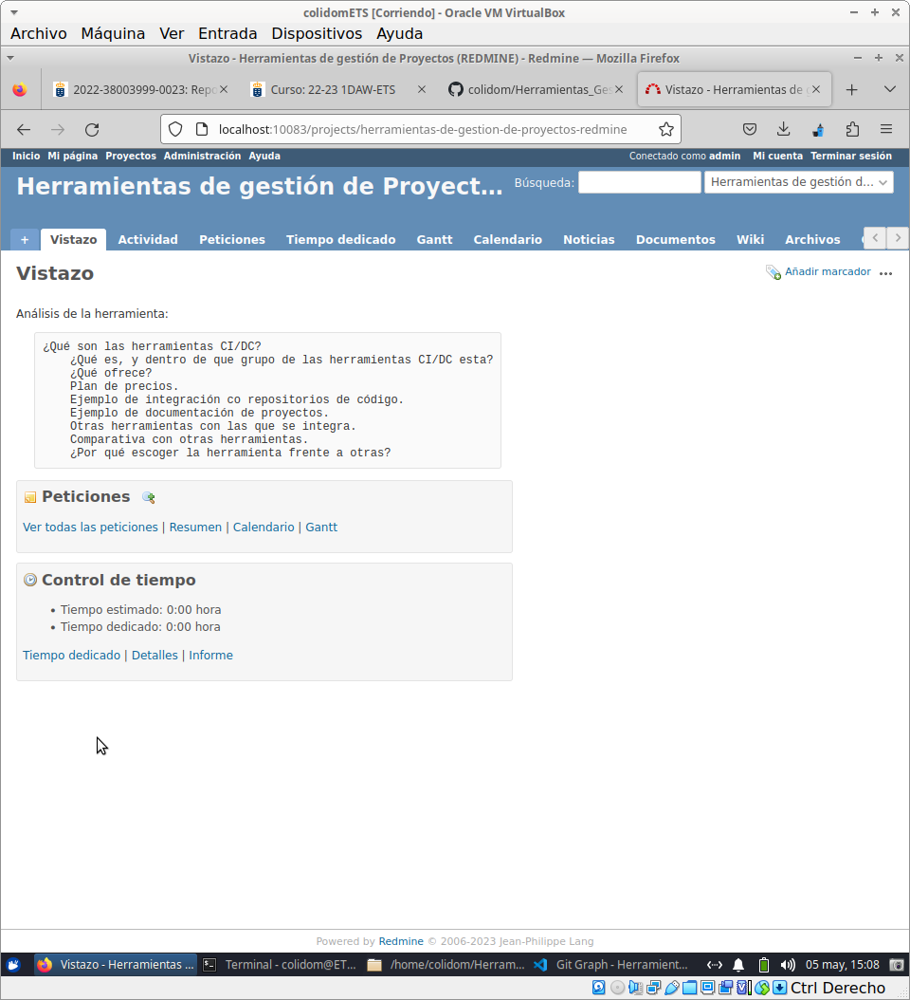
  
Una vez acabado el paso anterior podemos ver una **preview** de lo que tenemos echo en nuestro proyecto como puede ser un análisis (resumen), Peticiones realizadas por los usuarios y muy importante un control del tiempo dedicado y estimado al proyecto.

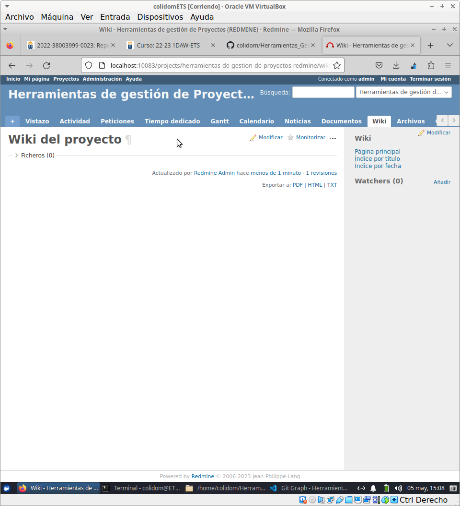
  
Otra de las diversas opciones que tiene Redmine es la **Wiki del proyecto** en el que podemos organizar y ordenar la infromación que tenemos del proyecto, esta opción tiene integrada la función de ver cuando fue actualizado, quien lo actualizo y las revisiones realizadas sobre él.

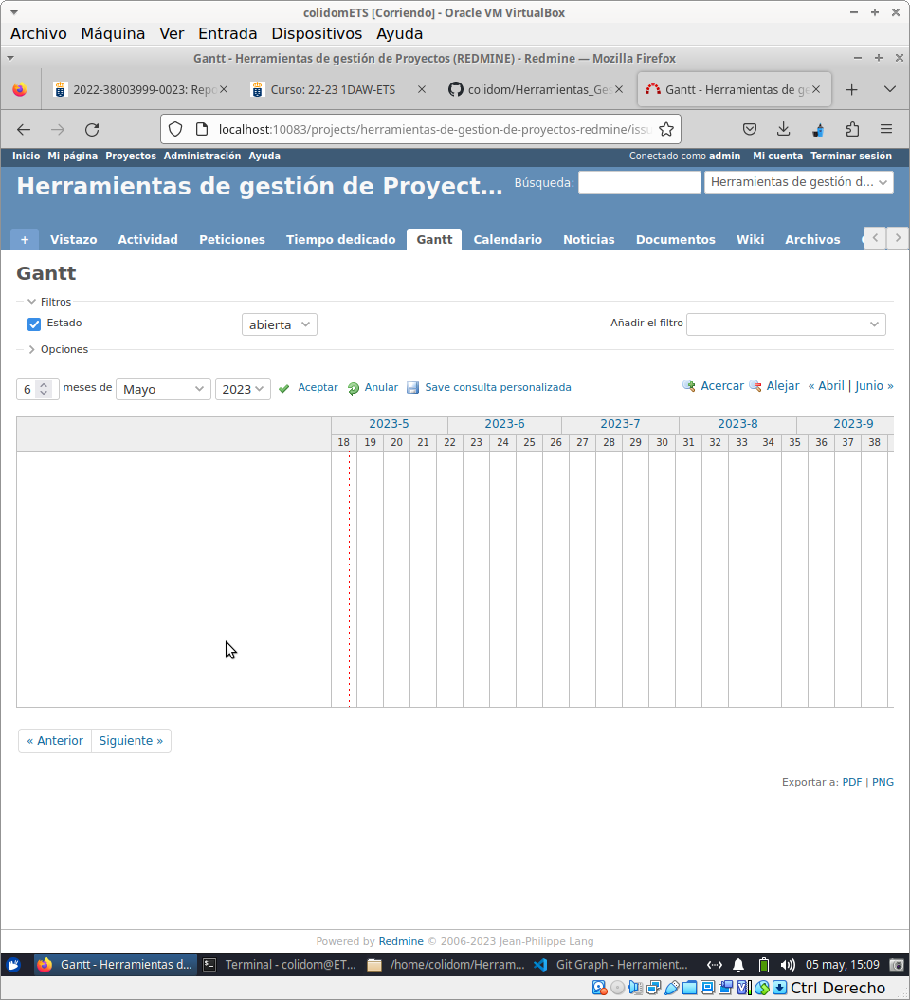
  
También cuenta con los **diagramas Gram** que sirven para visualizar los componentes básicos y no tan básicos de un proyecto y organizarlos en tareas más pequeñas y gestionable, estas a su vez pueden ser asignadas a diversos usuarios.

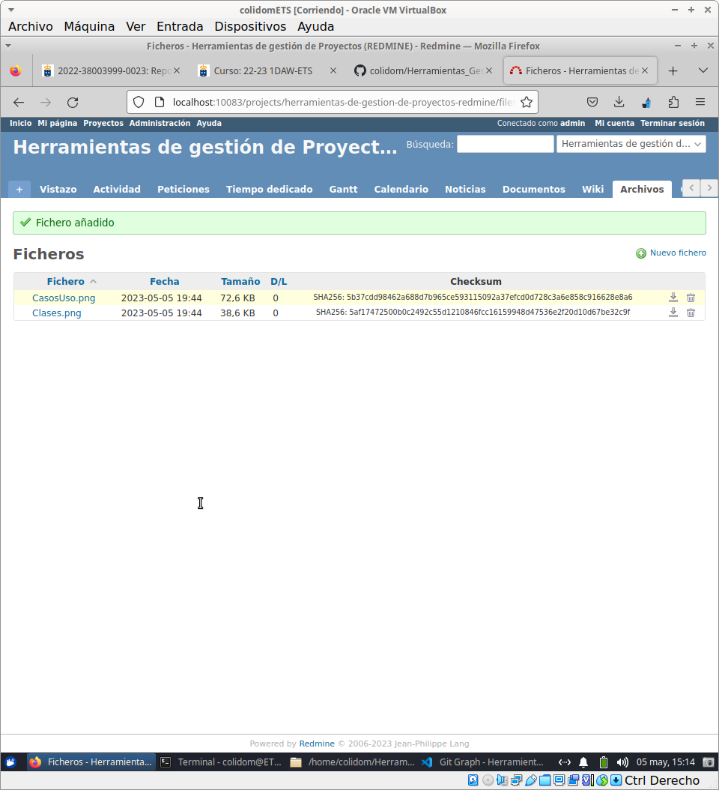
Redmine cuenta con un apartado en el que dentro del repositorio podemos ver y añadir **ficheros** especificamente.

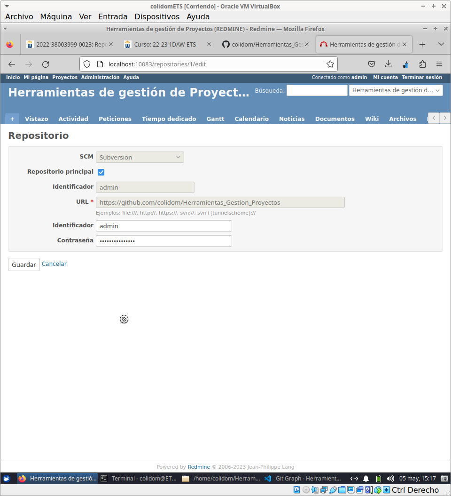
Del mismo modo contamos con un apartado en el que podemos modificar las *opciones del repositorio* en si.

  
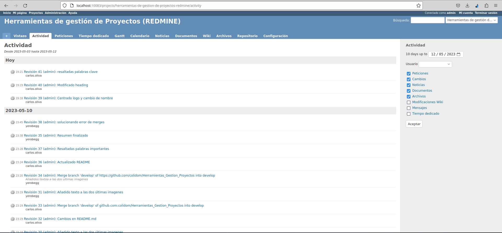
